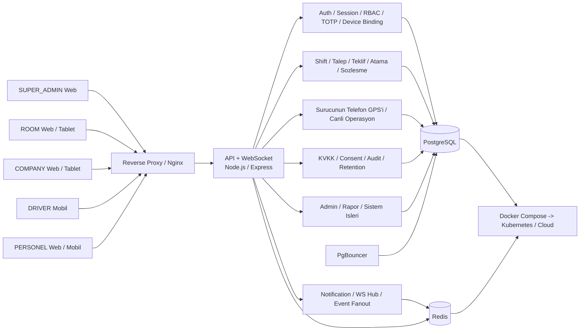
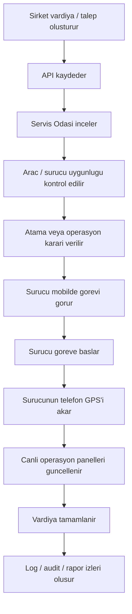

# SYSTEM ARCHITECTURE V1

Last updated: **2026-03-16**  
Scope: **PERSONEL SERVİS V1 güncel hedef ürün**

Bu doküman, güncel ürün hedefini esas alır. Ana roller:
- **SUPER_ADMIN**
- **SERVİS ODASI (ROOM)**
- **ŞİRKET (COMPANY)**
- **SÜRÜCÜ (DRIVER)**
- **PERSONEL**

Not:
- Eski scope izlerinde veli / öğrenci / okul tarafı bulunabilir.
- Bu doküman ana ürün omurgasını **personel servis operasyonu** üzerinden anlatır.

## 1) Kısa mimari özeti

Sistem 6 katmanlı düşünülür:
1. **İstemci katmanı** — web paneller + sürücü mobil
2. **Erişim ve güvenlik katmanı** — auth, refresh, RBAC, TOTP, device binding, KVKK gate
3. **Uygulama katmanı** — shift, teklif, atama, sözleşme, operasyon, bildirim
4. **Gerçek zamanlı katman** — WebSocket / canlı olay akışı
5. **Veri katmanı** — PostgreSQL + Redis + gerekiyorsa PgBouncer
6. **Infra katmanı** — reverse proxy, Docker Compose, cloud/k8s hazırlığı

## 2) Tasarım ilkeleri

- **Stateless backend:** RAM içinde kalıcı session/state tutulmaz.
- **REST + WS ayrımı:** CRUD/rapor işlemleri REST, canlı görünürlük ve bildirimler WS.
- **Rol ve scope bazlı erişim:** Her panel ve endpoint RBAC + scope mantığıyla korunur.
- **Canlı konum ayrı ele alınır:** Sürücünün telefon GPS'i operasyonel canlı veri olarak işlenir.
- **Audit / retention bilinci:** Güvenlik ve operasyon izleri saklanır.
- **Pilot-öncesi mobil güvenlik:** refresh, deviceId, PIN, secure storage temeli vardır.

## 3) Katmanlı görünüm

## 4) Modül grupları

### 4.1 Erişim ve güvenlik
- login / token / refresh session
- driver code + PIN girişi
- deviceId binding
- TOTP step-up
- RBAC + scope
- rate limit + edge security

### 4.2 Operasyon çekirdeği
- şirket iş / vardiya açar
- servis odası planlar
- teklif / onay / atama yapılır
- sözleşme veya operasyon kuralı uygulanır
- sürücü görevi mobilde görür

### 4.3 Canlı operasyon
- sürücünün telefon GPS'i API'ye gelir
- son konum + history yazılır
- ilgili paneller canlı yenilenir
- bildirim ve durum kartları güncellenir

### 4.4 KVKK ve denetim
- consent / aydınlatma gate
- audit log
- retention policy
- backup / export gibi yönetimsel güvenlik işleri

## 5) Ana veri akışı

## 6) Rol görünürlüğü

- **SUPER_ADMIN** — sistem ve güvenlik üst yönetimi
- **ROOM** — operasyon merkezi
- **COMPANY** — iş talebi ve kendi operasyon görünürlüğü
- **DRIVER** — görevi icra eder, canlı durum üretir
- **PERSONEL** — kendi taşıma bilgisini görür / takip eder

Detay rol akışları için:
- `docs/architecture/workflows/WORKFLOW_OVERVIEW_V1.md`
- `docs/architecture/workflows/roles/`

## 7) Güvenlik ve KVKK kısa notu

Bu mimari dokümanı teknik omurgayı anlatır. Tam güvenlik ve KVKK kapsaması için ilgili SSOT / runbook dokümanları ayrıca esas alınır:
- `docs/PRIMER_SSOT.md`
- `docs/STARTPACK_V1.md`
- `docs/RUNBOOK_M47_KVKK_NOTICE_CONSENT_FRAMEWORK.md`
- `docs/RUNBOOK_M46_8_DRIVER_ACCESS_HARDENING.md`
- `docs/RUNBOOK_M46_9_SESSION_REFRESH_SECURITY.md`
- `docs/RUNBOOK_M50_MOBILE_RELEASE_READINESS.md`

## 8) Bu dokümanın amacı

Bu belge:
- yeni sohbette mimari resmi hızlı hatırlatmak,
- repo içindeki teknik katmanları ortak dilde anlatmak,
- iş akışı dokümanları için giriş noktası olmak
amaçlarıyla tutulur.
