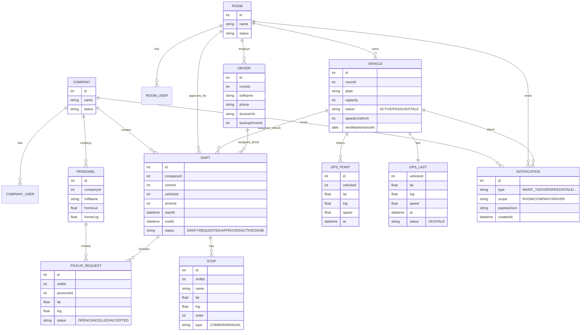

# PERSONEL-SERVIS V1 — DB SCHEMA (Mermaid)

```mermaid
erDiagram
  COMPANY ||--o{ COMPANY_USER : has
  ROOM    ||--o{ ROOM_USER    : has

  ROOM    ||--o{ VEHICLE : owns
  ROOM    ||--o{ DRIVER  : employs

  COMPANY ||--o{ SHIFT : creates
  ROOM    ||--o{ SHIFT : approves_for
  VEHICLE ||--o{ SHIFT : assigned_vehicle
  DRIVER  ||--o{ SHIFT : assigned_driver

  SHIFT   ||--o{ STOP : has
  COMPANY ||--o{ PERSONEL : employs
  PERSONEL ||--o{ PICKUP_REQUEST : creates
  SHIFT   ||--o{ PICKUP_REQUEST : includes

  VEHICLE ||--o{ GPS_POINT : history
  VEHICLE ||--|| GPS_LAST  : last

  COMPANY ||--o{ NOTIFICATION : emits
  ROOM    ||--o{ NOTIFICATION : emits
  VEHICLE ||--o{ NOTIFICATION : about

  COMPANY {
    int id
    string name
    string status
  }
  ROOM {
    int id
    string name
    string status
  }
  VEHICLE {
    int id
    int roomId
    string plate
    int capacity
    string status   "ACTIVE/PASSIVE/STALE"
    int speedLimitKmh
    date nextMaintenanceAt
  }
  DRIVER {
    int id
    int roomId
    string fullName
    string phone
    string deviceInfo
    int backupDriverId
  }
  SHIFT {
    int id
    int companyId
    int roomId
    int vehicleId
    int driverId
    datetime startAt
    datetime endAt
    string status "DRAFT/REQUESTED/APPROVED/ACTIVE/DONE"
  }
  STOP {
    int id
    int shiftId
    string name
    float lat
    float lng
    int order
    string type "COMMON/MANUAL"
  }
  PERSONEL {
    int id
    int companyId
    string fullName
    float homeLat
    float homeLng
  }
  PICKUP_REQUEST {
    int id
    int shiftId
    int personelId
    float lat
    float lng
    string status "OPEN/CANCELLED/ACCEPTED"
  }
  GPS_LAST {
    int vehicleId
    float lat
    float lng
    float speed
    datetime at
    string status "OK/STALE"
  }
  GPS_POINT {
    int id
    int vehicleId
    float lat
    float lng
    float speed
    datetime at
  }
  NOTIFICATION {
    int id
    string type "MAINT_7D/OVERSPEED/STALE/..."
    string scope "ROOM/COMPANY/DRIVER"
    string payloadJson
    datetime createdAt
  }
```

> Not: Prisma tarafında login/auth için `User` ve rota ilerleme için `ShiftProgress` ek tablolardır.