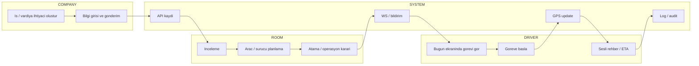
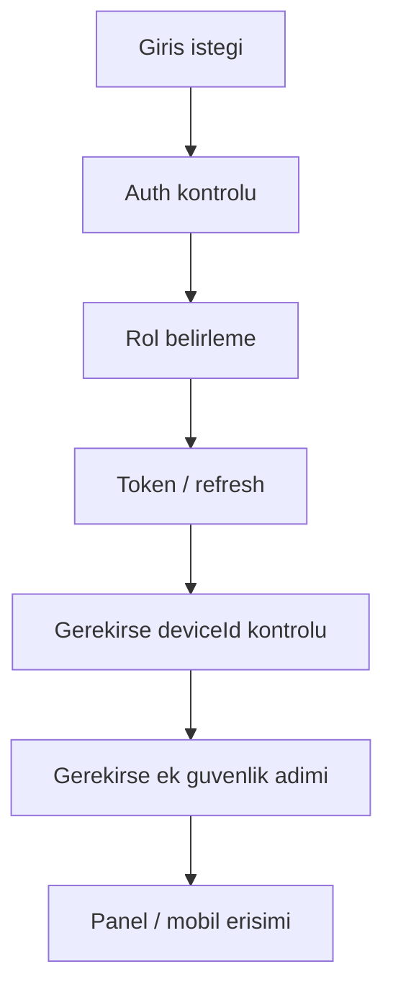
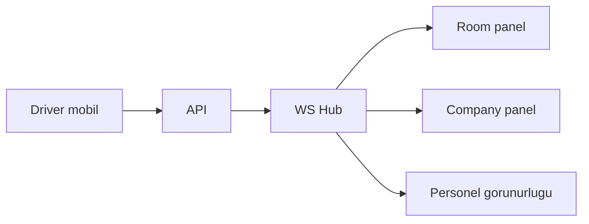

# WORKFLOW OVERVIEW V1

Last updated: **2026-03-16**

Bu belge, PERSONEL SERVİS V1 için uçtan uca ortak iş akışını anlatır.

## 1) Uçtan uca ana akış

## 2) Kim ne yapar?

### COMPANY
- taşıma ihtiyacını açar
- personel / saat / adres / vardiya bilgisini girer
- sonucu ve durumu izler

### ROOM
- operasyon merkezi gibi davranır
- işin planını yapar
- araç ve sürücü seçer
- gerekirse yeniden planlar

### DRIVER
- atanan görevi mobilde görür
- göreve başlar
- sürücünün telefon GPS'i ile canlı veri üretir
- rota / durak / ETA takibi yapar

### SYSTEM
- veriyi kaydeder
- canlı güncellemeyi dağıtır
- denetim izi bırakır

## 3) Yardımcı ortak akışlar

### 3.1 Kimlik doğrulama

### 3.2 Canlı durum ve bildirim

## 4) Rol bazlı detaylar

Detay belgeler:
- `roles/ROLE_WORKFLOW_SUPER_ADMIN_V1.md`
- `roles/ROLE_WORKFLOW_ROOM_V1.md`
- `roles/ROLE_WORKFLOW_COMPANY_V1.md`
- `roles/ROLE_WORKFLOW_DRIVER_V1.md`
- `roles/ROLE_WORKFLOW_PERSONEL_V1.md`
