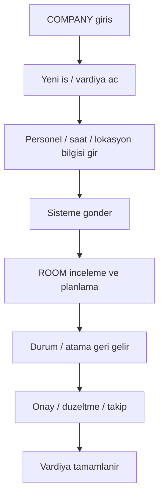

# ROLE WORKFLOW — COMPANY V1

## Rol amacı
Şirket, taşıma ihtiyacını oluşturan ve kendi operasyonunun sonucunu takip eden roldür.

## Ana akış

## Temel işleri
- taşıma ihtiyacı açmak
- vardiya zamanını ve hedef bilgisini girmek
- kendi personelini ve taşıma bilgisini yönetmek
- sonucu, onayı ve operasyon görünürlüğünü takip etmek

## Çıktıları
- yeni iş talebi
- güncellenmiş iş talebi
- operasyon görünürlüğü ve onay kararı
