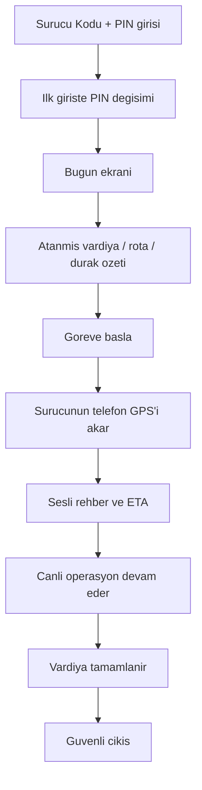

# ROLE WORKFLOW — DRIVER V1

## Rol amacı
Sürücü, atanan vardiyayı mobilde görür, görevi icra eder ve canlı operasyon verisini üretir.

## Ana akış

## Temel işleri
- güvenli giriş yapmak
- PIN değiştirmek
- o günkü görevi görmek
- rota ve durak akışını takip etmek
- sesli rehber / ETA kullanmak
- sürücünün telefon GPS'ini açık ve sağlıklı tutmak
- vardiyayı tamamlamak

## Kritik not
Bu rol, sistemin canlı operasyon verisini üreten ana saha rolüdür.
