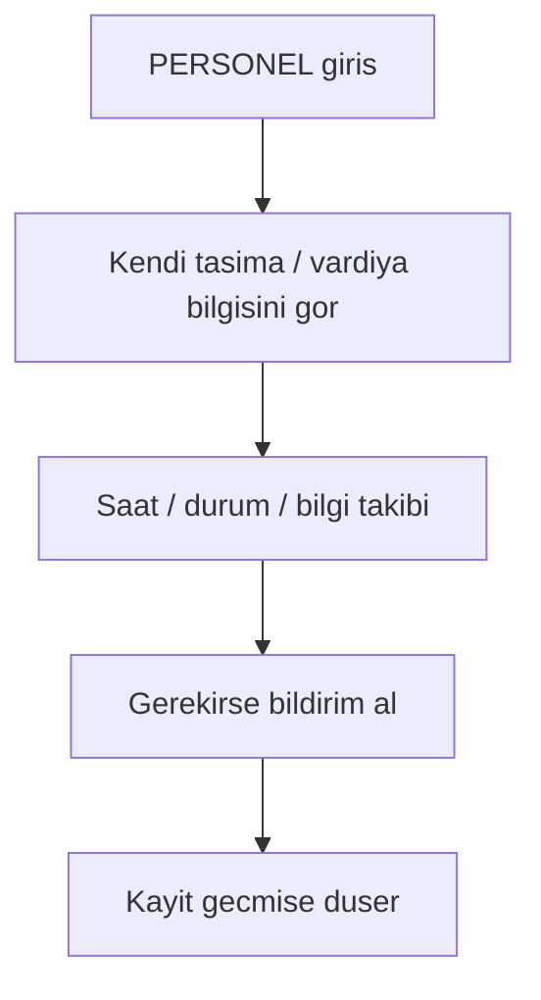

# ROLE WORKFLOW — PERSONEL V1

## Rol amacı
Personel, kendi taşıma bilgisini gören ve gerektiğinde bilgilendirme alan roldür.

## Ana akış

## Temel işleri
- kendi servis bilgisini görmek
- bilgilendirmeleri takip etmek
- operasyon sonucunu görmek

## Kapsam notu
Bu rol, güncel hedef üründe sürücü ve operasyon merkezi kadar ağır bir iş yükü taşımaz. Daha çok görünürlük ve bilgilendirme rolündedir.
