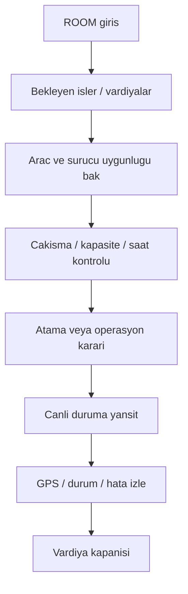

# ROLE WORKFLOW — ROOM V1

## Rol amacı
Servis Odası, operasyonun merkezidir. İşleri toplar, planlar, sürücü/araç eşlemesini yapar ve canlı operasyonu izler.

## Ana akış

## Temel işleri
- yeni iş ve vardiya görmek
- araç seçmek
- sürücü seçmek
- çakışma ve kapasite kontrolü yapmak
- atama veya yeniden planlama kararı vermek
- canlı harita ve bildirimleri takip etmek

## Kullandığı görünürlükler
- shifts / jobs
- drivers
- vehicles
- map / canlı operasyon
- notifications
