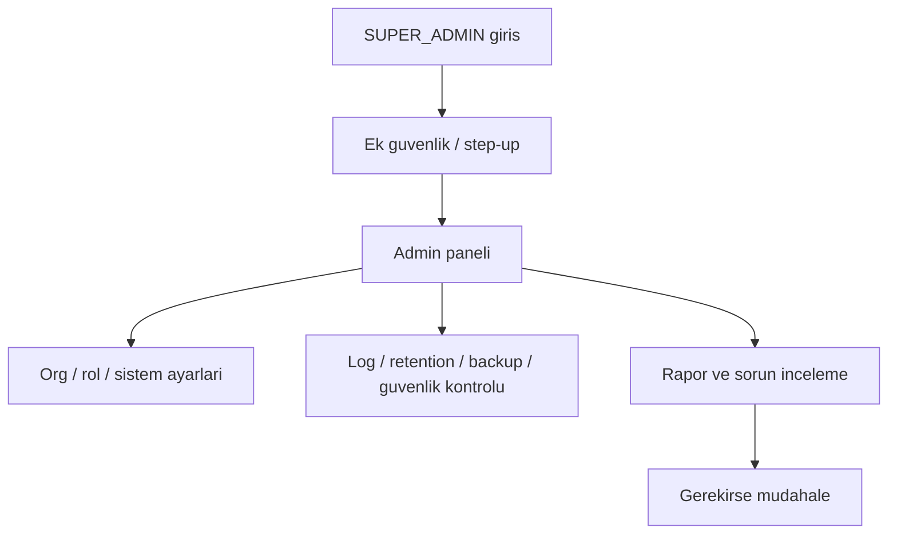

# ROLE WORKFLOW — SUPER_ADMIN V1

## Rol amacı
Sistem genelini yöneten üst roldür. Organizasyon, güvenlik, denetim ve bakım işlerini yönetir.

## Ana akış

## Temel işleri
- sistem ayarlarını görmek ve değiştirmek
- güvenlik / retention / backup durumunu takip etmek
- audit ve operasyonel anormallikleri incelemek
- gerekirse üst seviye müdahale yapmak

## Çıktıları
- politika ve ayar değişikliği
- yönetim kararı
- denetim ve izleme kaydı
